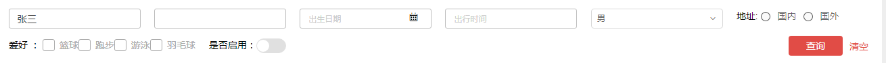
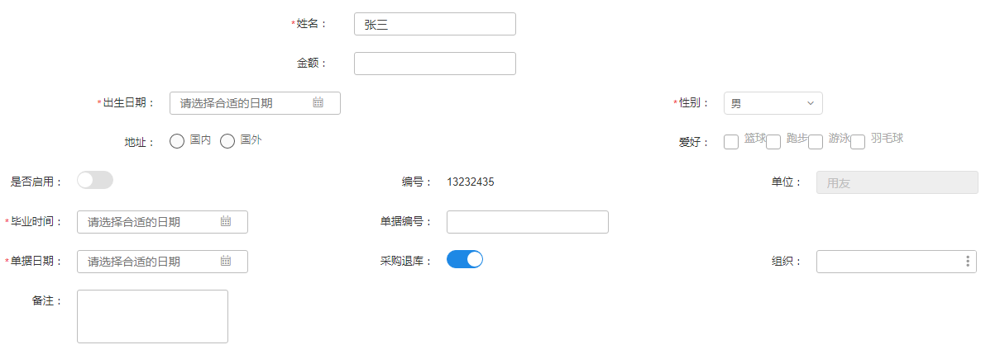
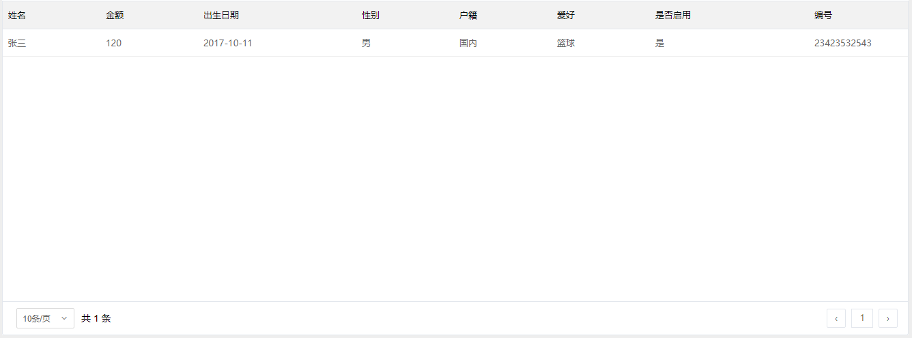
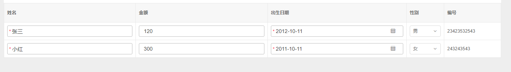

# UI模板结构说明

前端框架支持根据固定结构的UI模板json数据，自动渲染业务组件。

目前有3种类型的业务组件支持根据UI模板渲染，它们分别是：查询区、表单、表格。

每种业务组件支持的控件类型有 11 种，表一列出了所有控件类型。

##### 表一

类型值 | 说明
---|---
input  | 普通文本框，可以编辑
number | 数值文本框，只可以录入数值
textarea | 多行文本框，可以录入任意字符
datepicker | 单选日期框
rangepicker | 日期范围选择框
select | 下拉单选框
radio | 单选框
checkbox | 复选框
switch | 开关，boolean类型
label | 纯显示文本框，永久不可编辑
refer | 参照


## 一、查询区UI模板数据

### （一）示例

```
{
    searchAreaId:{
        moduletype:'search',
        items:[
            {
				attrcode:'name',
				label:'姓名',
				itemtype:'input',
				initialvalue:{value:'张三'}
			},
			{
				attrcode:'mny',
				label:'金额',
				itemtype:'number',
				scale:2
			},
			{
				attrcode:'date',
				label:'出生日期',
				itemtype:'datepicker'
			},
			{
				attrcode:'rangedate',
				label:'出行时间',
				itemtype:'rangepicker'
			},
			{
				attrcode:'sex',
				label:'性别',
				itemtype:'select',
				initialvalue:{value:0,display:'男'},
				options:[
					{
						display:'男',
						value:0
					},{
						display:'女',
						value:1
					}
				]
			},
			{
				attrcode:'address',
				label:'地址',
				itemtype:'radio',
				options:[
					{
						display:'国内',
						value:0
					},{
						display:'国外',
						value:1
					}
				]
			},
			{
				attrcode:'hobby',
				label:'爱好',
				itemtype:'checkbox',
				options:[
					{
						display:'篮球',
						value:0
					},{
						display:'跑步',
						value:1
					},{
						display:'游泳',
						value:2
					},{
						display:'羽毛球',
						value:3
					}
				]
			},
			{
				attrcode:'enable',
				label:'是否启用',
				itemtype:'switch'
			},
			{
				attrcode:'pk_org',
				label:'组织',
				itemtype:'refer',
				refcode:'pk_org'
			}
        ]
    }
}

```

### （二）UI渲染结果




### （三）每种控件的属性说明

#### 通用属性说明

表一描述的所有itemtype类型都具有以下属性

属性名 | 属性值类型 | 默认值 | 是否必输  |说明
---|---|---|---|---
attrcode | string | 无 | 是 | 英文名,唯一标识
label | string | 无 | 是 | 中文名
itemtype | string | 无 | 是 | 类型
initialvalue | object | 无 | 否 | 默认值

#### 特有属性说明

* itemtype类型为select/radio/checkbox 时需要的属性

属性名 | 属性值类型 | 默认值 | 是否必输  |说明
---|---|---|---|---
options | object | 无 | 是 | 选项

*  itemtype类型为number时需要的属性

属性名 | 属性值类型 | 默认值 | 是否必输  |说明
---|---|---|---|---
scale | number | 2 | 否 | 精度


## 二、表单UI模板数据

### （一）示例

```
{
    formAreaId:{
        moduletype:'form',
       items: [
			{
				attrcode: 'name',
				label: '姓名',
				itemtype: 'input',
				initialvalue: { value: '张三' },
				col: 12,
				required: true
			}, {
				attrcode: 'mny',
				label: '金额',
				itemtype: 'number',
				scale: 2,
				col: 12
			}, {
				attrcode: 'date',
				label: '出生日期',
				itemtype: 'datepicker',
				col: 6,
				required: true
			},
			{
				attrcode: 'sex',
				label: '性别',
				itemtype: 'select',
				initialvalue: { value: 0, display: '男' },
				options: [
					{
						display: '男',
						value: 0
					}, {
						display: '女',
						value: 1
					}
				],
				col: 6,
				required: true
			}, {
				attrcode: 'address',
				label: '地址',
				itemtype: 'radio',
				options: [
					{
						display: '国内',
						value: 0
					}, {
						display: '国外',
						value: 1
					}
				],
				col: 6
			}, {
				attrcode: 'hobby',
				label: '爱好',
				itemtype: 'checkbox',
				options: [
					{
						display: '篮球',
						value: 0
					}, {
						display: '跑步',
						value: 1
					}, {
						display: '游泳',
						value: 2
					}, {
						display: '羽毛球',
						value: 3
					}
				],
				col: 6
			}, {
				attrcode: 'enable',
				label: '是否启用',
				itemtype: 'switch',
				col: 4
			}, {
				attrcode: 'code',
				label: '编号',
				itemtype: 'label',
				initialvalue: { value: '13232435' },
				col: 4
			}, {
				attrcode: 'corporate',
				label: '单位',
				itemtype: 'input',
				initialvalue: { value: '用友' },
				disabled: true,
				col: 4
			}, {
				attrcode: 'gradtime',
				label: '毕业时间',
				itemtype: 'datepicker',
				col: 4,
				required: true
			},
			{
				attrcode: 'vbillcode',
				label: '单据编号',
				itemtype: 'input',
				col: 4,
				rightspace: 4
			},
			{
				attrcode: 'dbilldate',
				label: '单据日期',
				required: true,
				itemtype: 'datepicker',
				col: 4,
			},
			{
				attrcode: 'breturn',
				label: '采购退库',
				itemtype: 'switch',
				col: 4,
				initialvalue: { value: 1 },
			},
			{
				attrcode: 'next',
				label: '下个',
				itemtype: 'label',
				visible: false,
				col: 4
			},
			{
				attrcode: 'pk_org',
				label: '组织',
				itemtype: 'refer',
				refcode: 'pk_org',
				col: 4
			},
			{
				attrcode: 'memo',
				label: '备注',
				itemtype: 'textarea',
				col: 4,
				rows: 3
			}
			

		]
    }
}

```

### （二）UI渲染结果




### （三）每种控件的属性说明

#### 通用属性说明

表一描述的所有itemtype类型都具有以下属性

属性名 | 属性值类型 | 默认值 | 是否必输  |说明
---|---|---|---|---
attrcode | string | 无 | 是 | 英文名,唯一标识
label | string | 无 | 是 | 中文名
itemtype | string | 无 | 是 | 类型
visible | boolean | true | 否 | 是否显示该字段
initialvalue | object | 无 | 否 | 默认值
required | boolean | false | 否 | 是否必输
disabled | boolean | false | 否 | 是否可编辑
col | number | 6 | 否 | 占的列数
leftspace | number | 0 | 否 | 左空白列数
rightspace| number | 0 | 否 | 右空白列数

#### 特有属性说明

*  itemtype类型为 select/radio/checkbox 时需要的属性

属性名 | 属性值类型 | 默认值 | 是否必输  |说明
---|---|---|---|---
options | object | 无 | 是 | 选项

*  itemtype类型为 number 时需要的属性

属性名 | 属性值类型 | 默认值 | 是否必输  |说明
---|---|---|---|---
scale | number | 2 | 否 | 精度

*  itemtype类型为 textarea 时需要的属性

属性名 | 属性值类型 | 默认值 | 是否必输  |说明
---|---|---|---|---
rows | number | 1 | 否 | 占的行数


##  三、表格UI模板数据

目前框架中表格支持两类，一是带分页的弹窗编辑式表格simpleTable，二是不带分页的直接编辑式表格editTable。  

这两种表格UI模板结构的区别是：    

　simpleTable需要属性pagination 来描述分页信息
    
　editTable 不需要   
    
如分页信息：

 pagination: {
	pageSize: 10
 }
   
    
表示一页显示10条数据  


### （一）示例及渲染结果

simpleTable UI模板数据

```
{
    simpleTableId:{
        moduletype:'table',
        pagination: {
			pageSize: 10
		},
        items:[
            {
				attrcode:'name',
				label:'姓名',
				itemtype:'input'
			},{
				attrcode:'mny',
				label:'金额',
				itemtype:'number'
			},{
				attrcode:'date',
				label:'出生日期',
				itemtype:'datepicker'
			},{
				attrcode:'sex',
				label:'性别',
				itemtype:'select',
				options:[
					{
						display:'男',
						value:0
					},{
						display:'女',
						value:1
					}
				]
			},{
				attrcode:'household',
				label:'户籍',
				itemtype:'radio',
				options:[
					{
						display:'国内',
						value:0
					},{
						display:'国外',
						value:1
					}
				]
			},{
				attrcode:'hobby',
				label:'爱好',
				itemtype:'checkbox',
				options:[
					{
						display:'篮球',
						value:0
					},{
						display:'跑步',
						value:1
					},{
						display:'游泳',
						value:2
					},{
						display:'羽毛球',
						value:3
					}
				]
			},{
				attrcode:'enable',
				label:'是否启用',
				itemtype:'switch'
			},{
				attrcode:'code',
				label:'编号',
				itemtype:'label'
			},{
				attrcode:'pk_org',
				label:'组织',
				itemtype:'refer',
				refcode:'pk_org'
			}
        ]
    }
}

```

simpleTable UI渲染结果




editTable UI模板数据

```
{
    editTableId:{
        moduletype:'table',
        items:[
            {
				attrcode:'name',
				label:'姓名',
				itemtype:'input',
				required:true
			},{
				attrcode:'mny',
				label:'金额',
				itemtype:'number'
			},{
				attrcode:'date',
				label:'出生日期',
				itemtype:'datepicker',
				required:true
			},
			{
				attrcode:'sex',
				label:'性别',
				itemtype:'select',
				options:[
					{
						display:'男',
						value:0
					},{
						display:'女',
						value:1
					}
				]
			}
			,{
				attrcode:'code',
				label:'编号',
				itemtype:'label'
			},{
				attrcode:'pk_org',
				label:'组织',
				itemtype:'refer',
				refcode:'pk_org'
			}
        ]
    }
}
```

editTable  UI渲染结果




### （二）每种控件的属性说明

#### 通用属性说明

表一描述的所有itemtype类型都具有以下属性

属性名 | 属性值类型 | 默认值 | 是否必输  |说明
---|---|---|---|---
attrcode | string | 无 | 是 | 英文名,唯一标识
label | string | 无 | 是 | 中文名
itemtype | string | 无 | 是 | 类型
visible | boolean | true | 否 | 是否显示该列
width | number | 无　 | 否 | 列宽
initialvalue | object | 无 | 否 | 默认值
required | boolean | false | 否 | 是否必输


#### 特有属性说明

* itemtype类型为 select/radio/checkbox 时需要的属性

属性名 | 属性值类型 | 默认值 | 是否必输  |说明
---|---|---|---|---
options | object | 无 | 是 | 选项

*  itemtype类型为 number 时需要的属性

属性名 | 属性值类型 | 默认值 | 是否必输  |说明
---|---|---|---|---
scale | number | 2 | 否 | 精度


