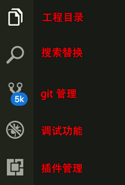
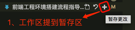
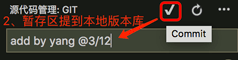
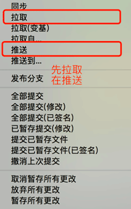

## 前端开发环境及工具

### 内容目录

[toc]

---
### 基本工具及环境

> 以下整理的前端开发基本工具,下载最新版即可。

####  一、浏览器

1. Chrome    [点此下载](http://www.google.cn/chrome/browser/desktop/index.html)

2. Firefox   [点此下载](http://www.firefox.com.cn/)

#### 二、编辑器

1. VScode [点此下载](https://code.visualstudio.com/)

<!--
2. Webstorm [点此下载](http://www.jetbrains.com/webstorm/)

3. Sublime [点此下载](https://www.sublimetext.com/3)

4. Atom [点此下载](https://atom.io/)
-->

#### 三、运行环境

1. 版本控制工具 Git [点此下载](https://git-scm.com/) [安装步骤](https://jingyan.baidu.com/article/020278117cbe921bcc9ce51c.html)

2. 前端运行环境 Node (LTS版本) [点此下载](https://nodejs.org/en/) 下一步直到到完成

---
---

> 以下非必看

#### 编辑器VScode界面介绍

#### 编辑器VScode基本配置  

win用户： 文件 > 首选项 > 设置  
mac用户： code > 首选项 > 设置

- 制表符长度：4
- 编码格式：`UTF-8`

#### 编辑器VScode插件推荐

- 插件
    - 快速格式化 **Prettier Now**
    - 快速代码生成 **JS JSX Snippets**

#### 编辑器git快捷介绍

`编辑器已经内置 git 插件，git为左侧列表第三个图标`
- 加号                    等于 git add -A 
- 对勾 + 文字区           等于 git commit -m "文字备注" 
- 点点点右键的拉取和推送  等于 git pull和git push     

---
