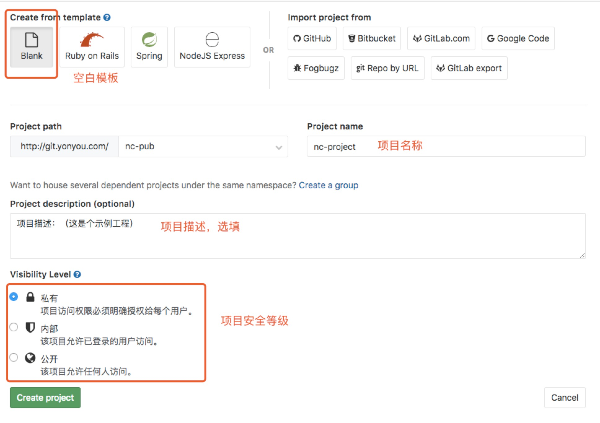
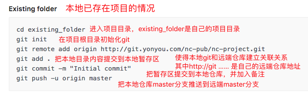

## 前端工程与远端仓库关联
---

####  一、远端仓库的建立

- 新建

- 填写基本信息（`如果是github，请不要勾选README.md选项`）

####  二、本地git的初始化

- git客户端或者cmd进入项目根目录  git init进行初始化
（初始化后会在此文件夹下生产一个.git的隐藏文件夹）

####  三、本地工作区推送到远端仓库

- git remote add origin 项目地址
- git add .
- git commit -m "备注信息"
- git push -u origin master

经过上述指令就把本地工作区的内容推送到远端了

---
