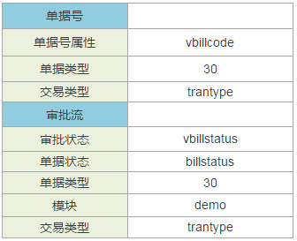

后端框架中，对于元数据，需要设计人员对如下几个方面做出详细描述：
##### 一、实体
对实体主要从以下几个方面描述：
###### 1.  实体总体描述：
    实体总体主要包括：命名空间、实体名称、实体中文描述、对应数据库表、实体主键、主键约束名称。例子如下：
-

子实体  | 子实体外键
---|---
investmentbody | investmentid

###### 2.  实体属性：
    实体属性即实体字段，需要从以下几个方面进行描述：中文描述、属性、业务类型、参照元数据、对应参照属性、长度、必输。

- 中文描述：字段的中文名；
- 属性：字段的名称，例如，币种字段的属性为“currtypeid”；
- 业务类型：字段在业务中对应的类型，业务类型是固定的一些值，字段的业务类型根据具体情况声明为对应的业务类型即可，业务类型包括如下值：名称、编码、单据号、备注、实体主键、关联表ID、参照、文本、小数、整数、布尔、日期、日期时间、整数枚举、字符枚举;
- 参照元数据：当业务类型为“参照”时，对应元数据的路径，例如“银行”字段为参照，对应的参照元数据需要设置为银行档案的元数据“bd.bank”;
- 参照元数据属性：当业务类型为“参照”时，如果字段需要做冗余，则配置字段在当前实体的属性名，例如，“银行”要做“银行名称”的冗余，则需要在银行（bank）字段上的“元数据属性”上配置银行名称（banknanme）；
- 长度：当业务类型为“文本”时，制定字段默认长度。只有业务类型为“文本”时，需要制定长度，其余业务类型均不需要指定；
- 必输：业务逻辑上的必输项，即需要代码中检查的必输项字段，并不是数据库中的必输项字段。例子如下：

中文描述 | 属性 | 业务类型 | 参照元数据| 对应参照属性| 长度| 必输 
---|---|---|---|---|---|---|
投资信息标识 | id | 实体主键|  |  |  | 
单据编号 | vbillno | 单据编号|  |  |  |  
银行 | bank | 参照|  bd.bank| bankname |  |是  
银行名称 | bankname | 名称|  |  |  |是

###### 3. 实体对应数据库索引：
索引需要对如下条目进行描述：索引中文描述、索引名、字段列表、备注。其中索引包含多个字段时，字段列表中填写的字段需要以英文字符的逗号“,”分隔。例子如下：

中文描述| 索引名| 字段列表（以,分隔）|备注
---|---|---|---
投资日期 | i_investment_date| investdate| 按照日期来查询投资信息

##### 二、枚举
枚举需要从以下两个方面进行描述：
###### 1.  枚举总体概况：
总体上，枚举包括：中文描述、命名空间、枚举名称、枚举类型。其中枚举类型包括两种：整数、字符串，设计时根据需要选择枚举类型。例子如下：
-

###### 2. 枚举值：
对于枚举值的设计比较简单，包括两个属性：枚举中文描述、枚举值。

中文描述 | 值
---|---
活期 | 1
三个月 | 2
半年 | 3
一年 | 4
三年| 5
五年| 6

##### 三、单据
单据从设计角度主要划分为如下几个层面：单据信息、精度业务、普通业务、冗余字段：

###### 1. 单据信息：
单据信息包括如下属性：中文描述、命名空间、单据名称、所属模块、主实体，以及子实体和子实体外键，例子如下：

-

子实体 | 子实体外键
---|---
investmentbody | investmentid

###### 2. 精度业务：
对于需要设置精度的实体属性，需要在精度业务中进行相应描述，描述主要从以下几个方面进行：
- 实体：需要精度处理实体属性对应的实体名；
- 属性：需要精度处理的实体属性名；
- 数值类型：需要精度处理实体属性的数值类型，包括金额、数量、单价三种；
- 影响因素1：进行精度处理的依据字段元数据路径，例如金额字段要根据币种字段进行精度处理，则影响因素1配置信息为“命名空间.实体名.币种属性名”；
- 影响因素2：当某个实体属性需要根据多个属性进行精度处理时，进行类似影响因素1的配置；
- 影响因素3：当某个实体属性需要根据多个属性进行精度处理时，进行类似影响因素1的配置；
例子如下：

实体 | 属性| 数值类型| 影响因素1| 影响因素2| 影响因素3
---|---|---|---|---|---
investment | investmny| 金额| demo.investment.currtypeid| | 

###### 3.  普通业务：
普通业务是对单据的单据号和审批流的描述：

- 单据号：单据如果需要系统自动生成单据号，则需要进行以下几个属性的配置：
单据号属性：即单据号实体属性名；
单据类型：即当前设计单据的单据类型值；
交易类型：即交易类型对应实体属性名；
- 审批流：如果单据支持审批流，则需要对如下属性进行配置：
审批流状态：实体中审批流属性字段名；
单据状态：实体中单据状态属性字段名；
单据类型：即当前设计单据的单据类型值；
模块：当前单据所模块；
交易类型：即交易类型对应实体属性名；
例子如下：

-

